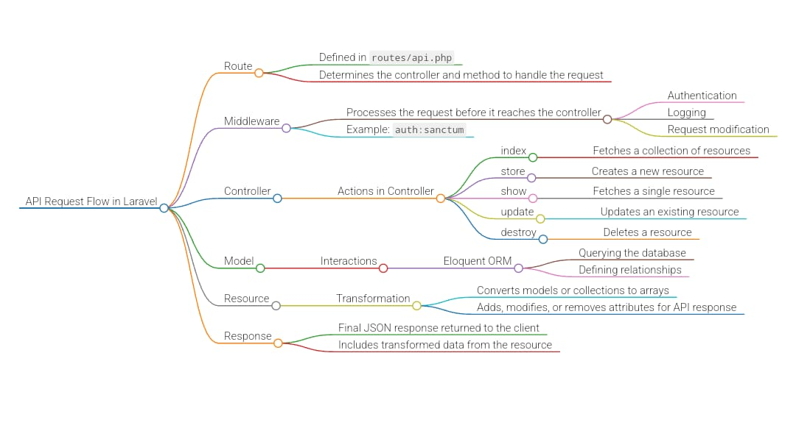

# Creating APIs with Laravel

## Introduction

This guide provides step-by-step instructions on how to create APIs using Laravel, a popular PHP framework. Follow these instructions to set up a Laravel project, define models, create controllers, and implement API endpoints.

## Step-by-Step Guide

### 1. Setup Laravel Base Project

Start by creating a new Laravel project using Composer:

### 2. Create Model, Factory, Form Requests, Migration, Policy, and Resource Controller

Run the following Artisan command to create a `Task` model along with its associated factory, form requests, migration, policy, and resource controller:

### 3. Configure Environment Variables

Add database connection details to your `.env` file for seamless database connectivity.

### 4. Define Task Table Structure

Define the structure of the `tasks` table and its columns along with their data types in the migration file `database/migrations/YYYY_MM_DD_202422_create_tasks_table.php`.

### 5. Define Factory for Fake Data Generation

Define a factory for generating fake data for the `Task` model. This factory will be used to seed the database with sample data. Define fake data types in the `database/factories/TaskFactory.php` file.

### 6. Add Factory Migration to Seeders

Include the factory migration in the seeders file to ensure that fake data is added to the database during migration.

### 7. Run Migrations

Execute the migration to create the `tasks` table in the database and seed it with fake data:

### 8. Create API Endpoints

Define your API endpoints by creating functions in the TaskController. For example, you can return all task data in the `index()` function. Register API route resources in the `routes/api.php` file to map endpoints to controller functions.

Now, you can use tools like Postman to test and fetch data from your API endpoints.

## Conclusion

This README provides a comprehensive guide on setting up a Laravel API project and creating endpoints to interact with your application's data. Follow these steps to get started with building powerful APIs using Laravel.

For more information and advanced features, refer to the Laravel documentation at [laravel.com/docs](https://laravel.com/docs).

Feel free to customize and enhance this README to suit your project's specific requirements and preferences. Happy coding!
